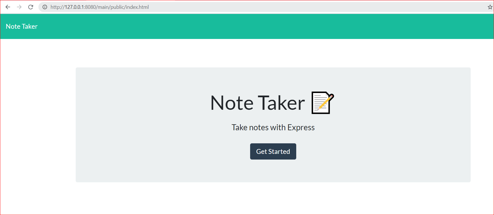

# notetaker
This application can be used to write, save, and delete notes. it use an express backend to save and retrieve note data from a JSON file.
# user story 

AS a user, I want to be able to write and save notes
I want to be able to delete notes I've written before so I can organize my thoughts and keep track of tasks I need to complete

# Repository
Heroku App
Project Repo
GitHub

The following screenshot shows the behaviour of this applicaton
1. Starting page 

2. Notes page [Notes.html](./main/public/assets/img/notes.png)

# deploy on heroku

